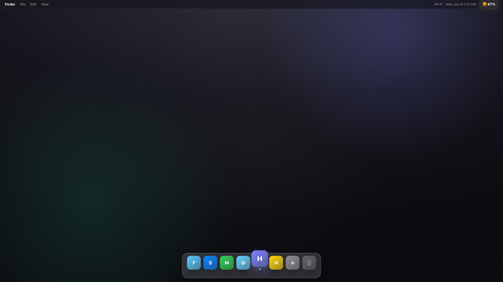

# Headroom

**Know your Claude limits before you hit them.**

Headroom is a free, lightweight macOS menu bar app that tracks your Claude **5-hour** and **weekly** usage windows with exact reset times, live countdowns, and native notifications.

[Live demo site](https://voxeldesignedit.github.io/headroom/) · [Download latest release](https://github.com/VoxelDesignedIt/headroom/releases/latest)



## Features

- Menu bar percentage with color-coded status
- Click to reveal 5-hour and weekly usage bars
- Exact reset timestamps (not rounded estimates)
- Live countdown timers
- macOS notifications at 75%, 85%, 90%, 95%
- Reset alerts only for the window that actually reset
- Secure Keychain cookie storage
- Launch at login

## Download

Grab the latest `Headroom-macOS.zip` from [Releases](https://github.com/VoxelDesignedIt/headroom/releases/latest), unzip, and open `Headroom.app`.

Or build from source:

```bash
cd app
./build.sh
open dist/Headroom.app
```

## Setup

1. Log in to [claude.ai](https://claude.ai)
2. Copy your `sessionKey` cookie (DevTools → Application → Cookies)
3. Open Headroom → Settings → paste → Save

## Project structure

```
headroom/
  app/     Native Swift menu bar app
  docs/    Landing page + promo video (GitHub Pages)
  video/   Remotion source for the promo
```

## Landing page

The one-page site lives in `docs/`. GitHub Pages serves it automatically.

To preview locally:

```bash
cd docs && python3 -m http.server 8080
```

## Promo video

```bash
cd video
npm install
npm run dev          # preview in Remotion Studio
npx remotion render HeadroomPromo ../docs/demo.mp4
```

## Privacy

- No analytics, accounts, or servers
- Session cookie stored locally in Keychain
- Direct calls to `claude.ai` usage API only

## Disclaimer

Headroom is an independent open-source utility built for Claude users. **Claude** is a trademark of Anthropic, PBC. This project is not affiliated with or endorsed by Anthropic.

## License

MIT
